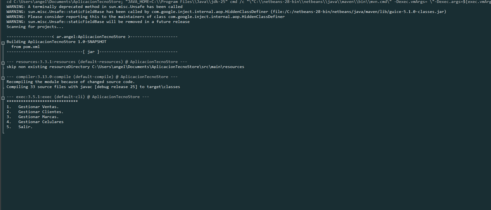
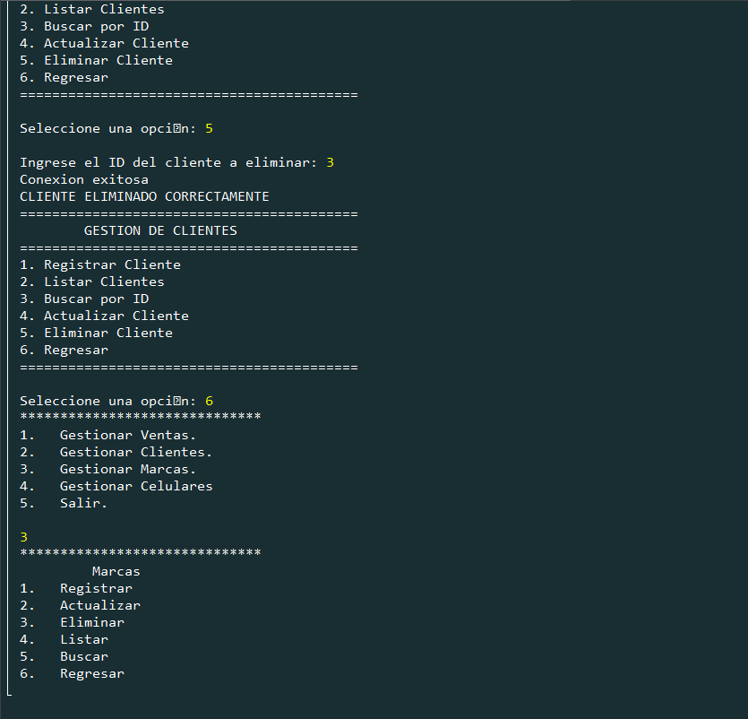
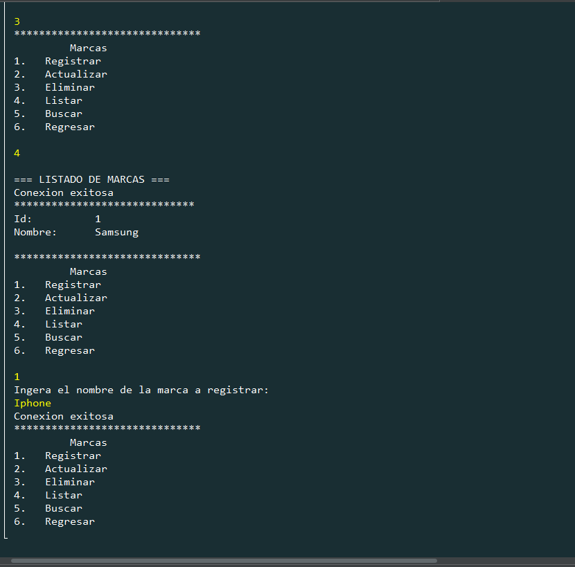
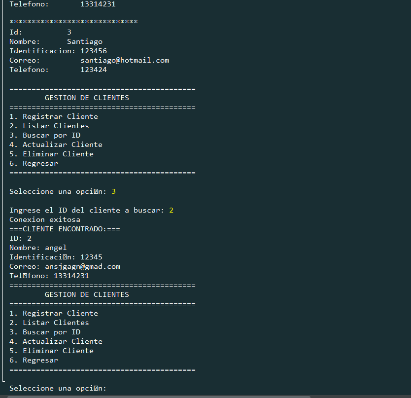

# TecnoStore - Proyecto JAVA con MySQL

Sistema de gestión de tienda tecnológica desarrollado en **Java** con conexión a base de datos **MySQL**.  
Proyecto final / práctico CampusLands

## Descripción del proyecto

**TecnoStore** es una aplicación de escritorio (o consola) que permite administrar productos tecnológicos en una tienda virtual/física.

Funcionalidades principales incluyen:
- Registro, modificación, eliminación y listado de productos
- Gestión de categorías de productos (celulares.)
- Control de stock de inventario.
- Búsqueda de productos por Identificador.
- Conexión a base de datos MySQL para persistencia de datos
- Interfaz consola.

## Tecnologías utilizadas

- **Lenguaje**: Java (JDK 11 o superior recomendado)
- **Base de datos**: MySQL
- **Patrón de diseño**: DAO 
- **Entorno de desarrollo**: NetBeans

## Estructura del proyecto

- `src/`: Código fuente de la aplicación
  - `dao/`: Clases DAO para acceso a datos
  - `model/`: Clases de modelo (entidades)
  - `service/`: Lógica de negocio

  
## Requisitos para ejecutar

1. Tener instalado:
   - JDK 11 o superior
   - MySQL Server (8.0 recomendado)
   - Apache Maven (o usar el que trae tu IDE)

2. Configurar la base de datos:
   ```sql
   -- Ejecuta el script Mysql.sql que está en la raíz
   mysql -u root -p  Mysql.sql


## Capturas de pantalla

Aquí algunas vistas del sistema:



GESTIONAR CLIENTES



GESTIONAR MARCAS


FILTRAR POR ID



##  Cómo clonar y ejecutar el proyecto (paso a paso)

### 1. Clonar el repositorio

Abre una terminal (Git Bash, PowerShell, CMD, Terminal, etc.) y ejecuta:

```bash
# Opción recomendada (clona con HTTPS)
git clone https://github.com/angeldavila00/ProyectoS1_TecnoStore_NinoAngel.git

# O con SSH (si ya configuraste tus claves SSH)
git clone git@github.com:angeldavila00/ProyectoS1_TecnoStore_NinoAngel.git

# Luego navega al directorio del proyecto
cd ProyectoS1_TecnoStore_NinoAngel
```

